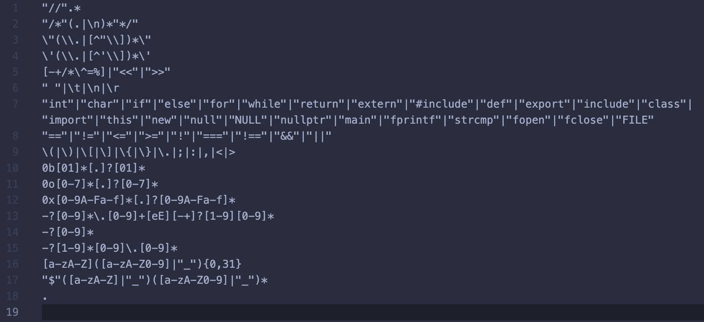
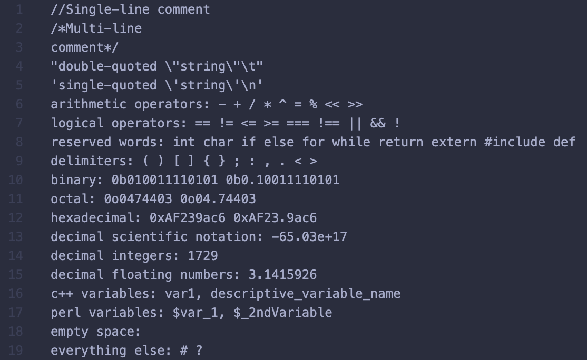
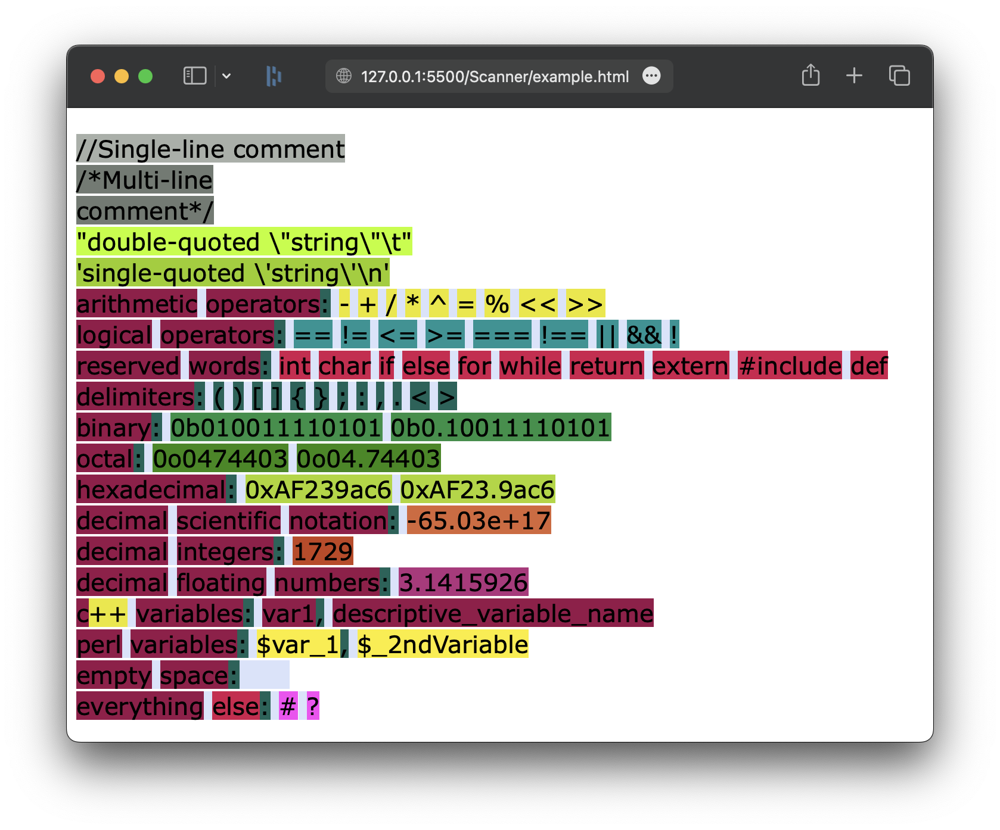
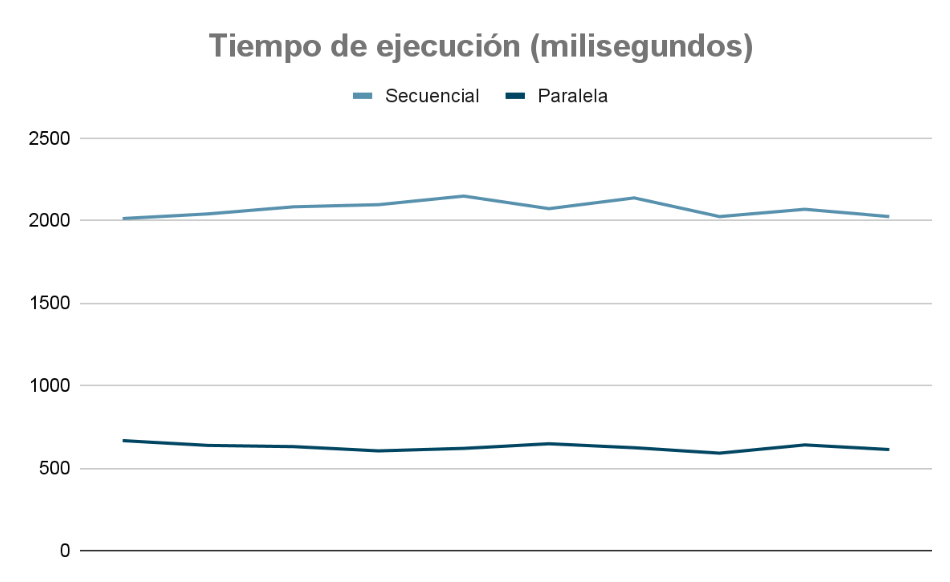
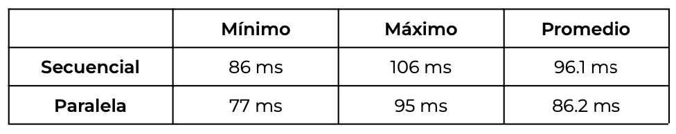
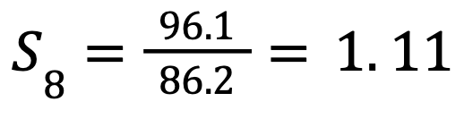

# Code Parser

#### Author: Oscar Valdés

## Description:

This repository uses the [flex](https://github.com/westes/flex) lexical analyzer generator to generate tokens from input files and display them in color-coded HTML files. The parser is written in C and it is automated for processing multiple files using Java. The repository includes a single-thread and a multi-threaded version of the parser and a comparison of the two.

## Instructions:

1. Clone this repository.
2. Install flex using your package manager. Run `flex --version` in your terminal to verify it.
3. Follow the steps **1 - 5** in **Scanner/scanner.md** to generate the scanner application.
4. Edit the directory path string in the files **Parallel/parSynt.java** and **Sequential/seqSynt.java** which says:
`/Users/oscar/Developer/Extras/Code-Parser/`
to match your folder structure. Use `\\` instead of `/` if you are on Windows.
5. Compile the java files with: `javac fileName.java` and then execute them using the `java fileName` command.
6. It might be necessary to change the `ProcessBuilder`'s working directory in **Parallel/parSynt.java** and **Sequential/seqSynt.java** to match your shell. There is a commented version tested on Windows.

#### Try the following:
- Add or edit the files in the **Inputs/** directories.
- Modify the searched regular expressions by following the instructions in **Scanner/scanner.md**.
- Change the number of threads in **Parallel/parSynt.java**.

## Examples:

#### Search patterns:

#### Input:

#### Output:

## Sequential vs Parallel:

A detailed description of the metodology and findings can be found in **Act5.3-IMC.pdf**. This are the highlights:

#### Tests' execution times:

#### Minimum, maximum and average execution times:

#### Sppeed-up:

#### Made With

    
    
    
    
    
    

